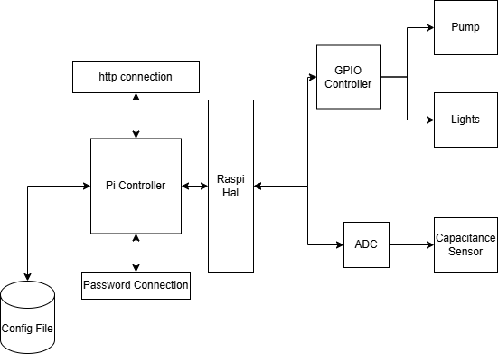

# plants-love-rust

This repository contains the PiGrow / "plants-love-rust" project, including a Rust firmware package in `firmware/` along with documentation, diagrams, and a bill of materials.

## What is plants-love-rust?
"plants-love-rust" is a hobbyist project to create a plant watering and care system using a Raspberry Pi and Rust firmware. The project aims to provide an open-source solution for automated plant care, leveraging Rust's safety and performance features. Current functionality includes GPIO control, scheduling, a terminal UI, and **soil moisture sensing via ADS1115 ADC with I2C communication**. The system features:
- Interval-based and schedule-based GPIO control
- Real-time soil moisture monitoring from a capacitive moisture sensor
- Live voltage display and moisture percentage with calibration
- Terminal UI with interactive controls for GPIO and sensor calibration

Code architecture is designed to be extensible for future features. Future improvements include web interface, automated watering based on moisture thresholds, and data logging.

## Challenges
Authors utilized windows systems for development, requiring cross-compilation to ARM for the Raspberry Pi. Setting up SSH-based deployment and ensuring GPIO access without root privileges were key challenges addressed in the project. Initial online suggestions were to open up home network access, but this was avoided for security reasons by using local network or VPN connections. Having an open port to the internet is not recommended for security! Instead, only local SSH access via VPN or local network was used. Second, there are a number of unanticipated bugs such as when the ssh connection drops (See current bugs). A Pi 3 A+ was used for this project, which has limited resources compared to newer models. Careful resource management and optimization were necessary to ensure smooth operation of the firmware on this hardware. For example, the PI could not run internet at all, and could not compile on the device at all! Cross-compilation was necessary to build the firmware on a more powerful development machine. Finding hardware and assembling the ciruits took about 30-40% of the project time which was unanticipated, as well as setting up the CI/CD pipeline for cross-compilation and deployment. Per usual, even getting started with embedded Rust toolchains takes time to get a working development environment.

### Current Bugs
- When the ssh connection drops, whatever the pin statis was (High or Low) it will stay that way even after the program is closed. This can be fixed by manually setting the pin state using the gpio command line tool on the Pi, but could be dangerous in a real world scenario if the pin is controlling something like a water pump.
- The schedule controller and interval controller can conflict if they are both trying to set the same pin at the same time. This can lead to unexpected behavior, such as the pin being set to High when it should be Low. This could be fixed by adding a mutex or some other form of synchronization between the two controllers.
- The terminal UI can be a bit finicky, especially when resizing the terminal window. This could be improved by using a more robust terminal UI library or by adding better error handling.
- During interval control, if the unterval goes below 100ms, the interval limit becomes 50ms and then never goes to numbers divisible by 100ums until going to the max clamped range of 10000ms and back down.
- 


## Contents
- `pigrow_project_proposal.pdf` — Project proposal and high-level goals.
- `Setup/` — Setup materials and supporting documents (see directory for details).
- `SystemArch.drawio` — System architecture diagram (draw.io file).
- `System_BOM.xlsx` — Bill of materials for hardware components.

## System Design Diagrams
- Architecture: [`SystemArch.drawio`](SystemArch.drawio) — open in the free draw.io app or VS Code Draw.io extension to view/edit.
- Bill of Materials: [`System_BOM.xlsx`](System_BOM.xlsx).
- Architecture (PNG preview):


## Status
- Type: Firmware + documentation
- Code: Rust firmware present under `firmware/`
- Project future:
	- Web interface
	- Automated watering based on moisture thresholds
	- Data logging
	- App communication with the Pi via Android or web app
	- Expandable sensor support (e.g., temperature, humidity)
	- Pi minimization for headless operation
	- Mobile app for remote monitoring and control

## AI Usage
Some documentation and code comments were generated or assisted by AI tools (ChatGPT-5). Code logic and structure were designed and implemented by the project authors. AI was used in the ssh deploy script generation and README writing. Source library use such as RPPAL was determined by the authors, GPIO and other hardware interfacing code was authored by the project team.


## Firmware scaffold
A minimal Rust firmware scaffold has been added in the `firmware/` folder. It contains a Cargo package you can build and run locally.

- `firmware/Cargo.toml` — package manifest for the firmware scaffold.
- `firmware/src/main.rs` — minimal `hello world` binary to replace with firmware logic.

To build and run from PowerShell:

```powershell
cd "c:\Users\adamm\Desktop\CS523 Rust Programming\plants-love-rust\firmware"
cargo build
cargo run
```

Keep docs in the repo root and code in `firmware/` to separate concerns.

## Hardware Setup

### Raspberry Pi 3 A+
This project targets a Raspberry Pi 3 A+ (ARM Cortex-A53). Below are recommended ways to build and run the firmware binary for that board.

### Wiring Diagram — ADS1115 & Moisture Sensor

**ADS1115 to Raspberry Pi (I2C):**
```
ADS1115          Raspberry Pi
-------          ------------
VDD      ────►   3.3V (Pin 1)
GND      ────►   GND (Pin 6)
SCL      ────►   SCL (Pin 5, GPIO 3)
SDA      ────►   SDA (Pin 3, GPIO 2)
ADDR     ────►   GND (sets I2C address to 0x48)
```

**Capacitive Moisture Sensor v1.2 to ADS1115:**
```
Moisture Sensor  ADS1115/Pi
---------------  ----------
VCC      ────►   3.3V or 5V (check sensor rating)
GND      ────►   GND
AOUT     ────►   A3 (ADS1115 analog channel 3)
```

***GPIO Pins:**

- Default GPIO pin for interval control: GPIO17 (Pin 11)
GND ────► GND (Pin 9)
VCC ────► GPIO Pin 17 (Pin 11)
Gnd ────► GND (Pin 9)
VCC ────► GPOI Pin 27

**Enable I2C on the Pi:**
```bash
sudo raspi-config
# Interface Options → I2C → Enable
sudo reboot

# Verify I2C device detection (should show 0x48):
i2cdetect -y 1
```

- Build directly on the Pi (easiest): install Rust via `rustup` on the Pi and `cargo build --release` in the `firmware/` folder.
- Cross-compile from another machine: use `cross` (Docker-based) or add the appropriate Rust target and a cross-linker toolchain for `armv7-unknown-linux-gnueabihf` (32-bit OS) or `aarch64-unknown-linux-gnu` (64-bit OS).

Decide which target triple matches your Pi OS:
- Raspberry Pi OS 32-bit (most common): `armv7-unknown-linux-gnueabihf`
- Raspberry Pi OS 64-bit / other 64-bit OS: `aarch64-unknown-linux-gnu`

If you need help determining your Pi's running architecture, run `uname -m` on the Pi — `armv7l` indicates the 32-bit case; `aarch64` indicates 64-bit.

## CI / Cross-compile and Deploy
A GitHub Actions workflow has been added at `.github/workflows/ci.yml` to cross-compile the `firmware` package for the common Pi targets and upload the resulting binaries as workflow artifacts.

Optional automatic deploy: the workflow contains an optional `deploy` job that will SCP the `armv7` binary to a Pi reachable at the hostname `plants-love-rust` and run it. For the deploy step to work you must add the following repository secrets in GitHub:

- `SSH_PRIVATE_KEY` — the private SSH key (PEM) for a user that can SSH to the Pi.
- `PI_USER` — the username on the Pi (commonly `pi`).

Setup on the Pi:

1. Add the corresponding public key to `/home/<pi-user>/.ssh/authorized_keys` on the Pi.

Note: For security, GitHub Actions is not recommended so that you do not expose your Pi to the public internet. Instead, connect the the Pi over local network or VPN by running the deploy step from a trusted network within which the Pi is reachable (e.g., your home network).

2. Ensure the Pi hostname `plants-love-rust` resolves on the GitHub Actions runner network (usually via your VPN or a public IP). If your Pi is behind NAT, consider a VPN or a build artifact download + manual deploy.

Security note: keep `SSH_PRIVATE_KEY` secret and give it only minimal privileges. The workflow uses `ssh` and `scp` to copy and execute the binary.

To trigger the workflow manually, go to the Actions tab and run the `CI — Cross-compile & optional deploy` workflow with `workflow_dispatch`, or push to `main`.

### Build & Deploy to Raspberry Pi (Windows, PowerShell 7)
Use the deploy script. Defaults: host `plants-love-rust`, user `user`, key `scripts/id_rsa_plants`.

```powershell
# From the REPO ROOT
# One-command: build for the Pi (auto-detect arch), upload, and run in background
pwsh -File .\scripts\deploy.ps1 -BuildLocal -Run

# Include GPIO feature (requires wiring and group permissions on the Pi)
pwsh -File .\scripts\deploy.ps1 -BuildLocal -Run -Features gpio

# Instead of running, restart a systemd service you created on the Pi
pwsh -File .\scripts\deploy.ps1 -BuildLocal -ServiceName plants-firmware

# Alternative: build on the Pi (upload source, remote cargo build), then run
pwsh -File .\scripts\deploy.ps1 -BuildOnPi -Run
pwsh -File .\scripts\deploy.ps1 -BuildOnPi -Run -Features gpio

# From the SCRIPTS FOLDER (cd .\scripts first) — drop the 'scripts/' prefix
pwsh -File .\deploy.ps1 -BuildLocal -Run -Features gpio
```

### Firmware Features (runtime)
- Terminal UI with controls:
	- `q`/`Esc`: quit
	- `b`: toggle blink
	- `+`/`-`: adjust interval (ms)
	- `d`: calibrate dry value (sensor in air or dry soil)
	- `w`: calibrate wet value (sensor in water or saturated soil)
- Interval GPIO controller on `gpio_pin` (default 17)
- Optional schedule controller on `schedule_pin` (default 27)
	- Reads day/time ranges from config and sets pin High/Low accordingly
- **Soil moisture sensing via ADS1115 (I2C)**:
	- Real-time display of raw ADC value, voltage, and moisture percentage
	- Calibration values saved to config for persistent moisture readings
	- 16-bit resolution (±4.096V range) on A3 channel
- `--features gpio` is required to access real GPIO and I2C on the Pi

### Configuration (on the Pi)
The firmware loads settings from `~/.config/plants-love-rust/config.toml`.

Keys:
- `blink_on` (bool), `interval_ms` (u64), `gpio_pin` (u8), `invert` (bool)
- `schedule_pin` (u8) and optional `[schedule]` table for day ranges
- `moisture_dry_value` (i16, optional): calibrated raw ADC value for dry soil
- `moisture_wet_value` (i16, optional): calibrated raw ADC value for wet soil

Example:
```toml
blink_on = true
interval_ms = 1500
gpio_pin = 17
invert = false
schedule_pin = 27
moisture_dry_value = 15000
moisture_wet_value = 27000

[schedule]
Monday = [[0, 900]]
Tuesday = [[0, 900]]
Wednesday = [[0, 900]]
Thursday = [[0, 900]]
Friday = [[0, 900]]
Saturday = [[0, 900]]
Sunday = [[0, 900]]
```

**Calibration:**
1. Run the firmware and press `d` with the sensor in dry air/soil
2. Press `w` with the sensor in water or fully saturated soil
3. Values are automatically saved to config for persistent moisture % readings

Schedule validation:
- Times are HHMM with `HH < 24` and `MM < 60`, and `start < end`
- Overlapping/adjacent ranges are merged; invalid entries are ignored with a log

Notes:
- Requires PowerShell 7 (pwsh). Install Docker Desktop for faster cross-compiles with `cross`.
- The script uploads a binary to `~/plants-love-rust/firmware/target/release/plants_love_rust_firmware` and then runs/restarts as requested.
- The script defaults to using the SSH key at `scripts/id_rsa_plants`. Override with `-KeyPath` if needed.
- `-BuildOnPi` uploads a source archive and compiles on the Pi (first run may install Rust with rustup minimal profile).

### Binary-only deploy
If you already have a Pi-compatible binary (from cross compile or CI), you can upload and run it without building on the Pi:

```powershell
# Upload and run
pwsh -File .\scripts\deploy.ps1 -BinaryPath "C:\path\to\plants_love_rust_firmware" -Run

# Upload and restart a systemd service
pwsh -File .\scripts\deploy.ps1 -BinaryPath "C:\path\to\plants_love_rust_firmware" -ServiceName plants-firmware

# Download the latest GitHub Actions artifact and deploy
# Requires a GitHub token in $env:GITHUB_TOKEN or pass -GitHubToken
pwsh -File .\scripts\deploy.ps1 -UseLatestArtifact -Run
```

The script will detect the Pi architecture via `uname -m` and try to pick the correct binary from the artifact. Set `-BinaryName` if your artifact uses a different filename.

### Manual cross-compile (64-bit Pi OS)
If you prefer to build yourself with `cross` (Docker), then deploy:

```powershell
cargo install cross
cross build -p plants_love_rust_firmware --target aarch64-unknown-linux-gnu --release
pwsh -File .\scripts\deploy.ps1 -BinaryPath \
	".\target\aarch64-unknown-linux-gnu\release\plants_love_rust_firmware" -Run
```

### Run from the Pi GUI (TigerVNC/Desktop)
If you want a double‑click icon in the Pi’s desktop session, create a small run script and a desktop launcher on the Pi. These commands assume the default deploy paths and username `user`. Adjust if your username or `-RemoteDir` differs.

On the Pi (open a terminal in the GUI):

```bash
# 1) Create a helper script that opens in a terminal and shows output/logs
cat > /home/user/plants-love-rust/firmware/run_firmware.sh << 'EOF'
#!/usr/bin/env bash
cd /home/user/plants-love-rust/firmware
./target/release/plants_love_rust_firmware 2>&1 | tee -a run.log
read -p "Press Enter to close..."
EOF
chmod +x /home/user/plants-love-rust/firmware/run_firmware.sh

# 2) Create a desktop launcher (.desktop file)
cat > /home/user/Desktop/PlantsFirmware.desktop << 'EOF'
[Desktop Entry]
Type=Application
Name=Plants Firmware
Comment=Run plants-love-rust firmware
Exec=x-terminal-emulator -e /home/user/plants-love-rust/firmware/run_firmware.sh
Path=/home/user/plants-love-rust/firmware
Terminal=false
Icon=system-run
Categories=Utility;
EOF
chmod +x /home/user/Desktop/PlantsFirmware.desktop
```

Background‑only variant (no terminal):

```bash
cat > /home/user/Desktop/PlantsFirmwareBackground.desktop << 'EOF'
[Desktop Entry]
Type=Application
Name=Plants Firmware (background)
Comment=Run plants-love-rust firmware in background
Exec=/bin/bash -lc 'cd /home/user/plants-love-rust/firmware; nohup ./target/release/plants_love_rust_firmware > run.log 2>&1 &'
Path=/home/user/plants-love-rust/firmware
Terminal=false
Icon=system-run
Categories=Utility;
EOF
chmod +x /home/user/Desktop/PlantsFirmwareBackground.desktop
```

GPIO permission reminder: ensure the GUI user belongs to the `gpio` group if you use GPIO (no sudo required):

```bash
groups
sudo usermod -aG gpio user  # then re-login or reboot to apply
```


### Creating SSH keys and adding GitHub secrets
If you want the workflow to automatically deploy to your Pi (`plants-love-rust`), follow these steps locally and then add secrets in GitHub.

1) Generate a keypair on your development machine (examples included in `scripts/`):

Bash (Linux/macOS):
```bash
./scripts/generate_ssh_key.sh id_rsa_plants
```

PowerShell (Windows):
```powershell
.\scripts\generate_ssh_key.ps1 -KeyName id_rsa_plants
```

2) Copy the public key to the Pi (replace `<pi-user>`):
```bash
scp id_rsa_plants.pub <pi-user>@plants-love-rust:~/
ssh <pi-user>@plants-love-rust "mkdir -p ~/.ssh && cat ~/id_rsa_plants.pub >> ~/.ssh/authorized_keys && rm ~/id_rsa_plants.pub"
```

3) Add the private key to GitHub repository secrets:

- Open the repository on GitHub -> Settings -> Secrets -> Actions -> New repository secret.
- Secret name: `SSH_PRIVATE_KEY`
- Secret value: the full contents of `id_rsa_plants` (the private key file). Do NOT add the `.pub` file.
- Add another secret `PI_USER` with the Pi username (e.g., `pi`).

Alternative: use the `gh` CLI to create secrets (example):

```bash
# Install gh and authenticate first
gh secret set SSH_PRIVATE_KEY --body-file id_rsa_plants
gh secret set PI_USER --body "pi"
```

4) Test SSH connectivity from your machine before relying on the workflow:

```bash
ssh <pi-user>@plants-love-rust hostname && ssh <pi-user>@plants-love-rust uname -m
```

If the Pi is reachable and the above prints the hostname and architecture, the deploy step should work when the workflow runs.
## Getting started (suggested)
If you'd like to turn this into a Rust project, here are recommended initial steps (run in PowerShell):

```powershell
cd "c:\Users\adamm\Desktop\CS523 Rust Programming\plants-love-rust"
cargo init --bin    # create a new Rust binary project in this folder (or in a subfolder)
cargo build
cargo run
```

Notes:
- If you prefer to keep docs separate from code, create a `firmware/` or `src/` subdirectory and initialize the Cargo package there.
- Add a `.gitignore` for target/ and other build artifacts if you scaffold a cargo project.

## Contributing
- Open an issue or pull request describing changes.
- Suggested first tasks: add `Cargo.toml`, scaffold `src/main.rs`, add a small README section describing the runtime, and add a license.

## License

Licensed under either of:

- Apache License, Version 2.0 ([LICENSE-APACHE](LICENSE-APACHE) or http://www.apache.org/licenses/LICENSE-2.0)
- MIT license ([LICENSE-MIT](LICENSE-MIT) or http://opensource.org/licenses/MIT)

at your option.

### Contribution

Unless you explicitly state otherwise, any contribution intentionally submitted for inclusion in the work by you, as defined in the Apache-2.0 license, shall be dual licensed as above, without any additional terms or conditions.

## Contact / Author
Project files in this repo are provided by the project authors. For questions, open an issue in this repository.

---
_Automatically added README summarizing repository contents._
